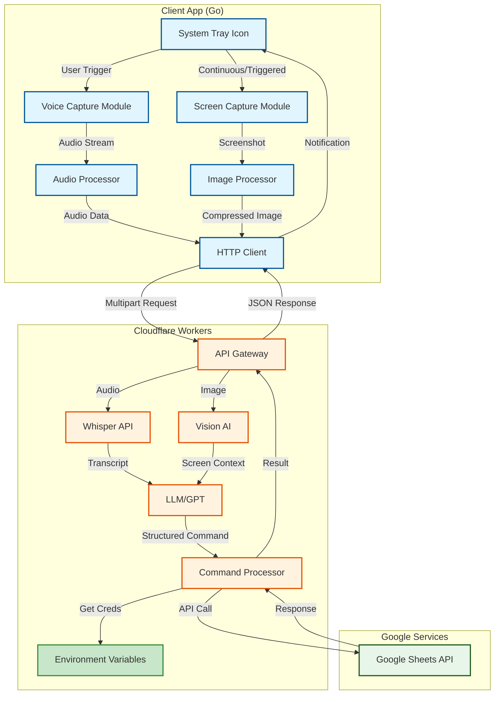

# Swear by Sheets

```mermaid
graph TB
    subgraph "Client App (Go)"
        ST[System Tray Icon]
        VC[Voice Capture Module]
        SC[Screen Capture Module]
        IP[Image Processor]
        AC[Audio Processor]
        HC[HTTP Client]

        ST --> |User Trigger| VC
        ST --> |Continuous/Triggered| SC
        VC --> |Audio Stream| AC
        SC --> |Screenshot| IP
        AC --> |Audio Data| HC
        IP --> |Compressed Image| HC
    end

    subgraph "Cloudflare Workers"
        API[API Gateway]
        WS[Whisper API]
        VA[Vision AI]
        LLM[LLM/GPT]
        CM[Command Processor]
        ENV[Environment Variables]

        API --> |Audio| WS
        API --> |Image| VA
        WS --> |Transcript| LLM
        VA --> |Screen Context| LLM
        LLM --> |Structured Command| CM
        CM --> |Get Creds| ENV
    end

    subgraph "Google Services"
        GS[Google Sheets API]

        CM --> |API Call| GS
    end

    HC --> |Multipart Request| API
    GS --> |Response| CM
    CM --> |Result| API
    API --> |JSON Response| HC
    HC --> |Notification| ST

    classDef client fill:#e1f5fe,stroke:#01579b,stroke-width:2px
    classDef cloudflare fill:#fff3e0,stroke:#e65100,stroke-width:2px
    classDef google fill:#e8f5e9,stroke:#1b5e20,stroke-width:2px
    classDef env fill:#c8e6c9,stroke:#388e3c,stroke-width:2px

    class ST,VC,SC,IP,AC,HC client
    class API,WS,VA,LLM,CM cloudflare
    class GS google
    class ENV env
```
